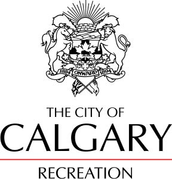

# CPSC 481 - Tutorial 03 - Group 04

## Our Team!

* Austin Wattling	10124473 
* Matthew Mullins	10122932
* Stefen Jovanovic	10135783
* Tutorial Section: 03
* TA: Sydney Pratte

## Calgary Recreational Facilities Information Application

 The nature of our project is a recreational information application, which excels in providing information about recreation centers across Calgary. Our system is intended to be used as a phone application in which users are able to determine closest location of facilities within Calgary, as well as learn any information that they may need in terms of cost, facilities, or any classes / programs that they offer. We expect a wide variety of users ranging from everyday people looking for something fun to do that day all the way to parents looking for classes and day camps for their children. We want public events hosted and news posted by the recreational center to be easily accessible and advertised within the application. This could cause immediate changes to people's plans and the information they desire but could encourage more people to come out to such events. However we do not want to interfere with people looking to get straight to the information they need and this will be our primary focus. We will direct our application towards audiences of all ages and ethnicities as we feature a collection of locations across the city in which people can find what works best for them. We will also consider people needing information in a hurry and potentially with limited experience with technology. We expect people will use the application when making plans in the current moment and those planning to visit the recreational centers in the future. 
