# P2: Ideation and Lo-fi Prototypes

## Video Prototype

[YouTube Video](https://youtu.be/yxJq2MgpQ1w)

User is presented with a list of all the recreation centers. Clickon one of them to view more information. Is taken to the main page of the recreation center. Clicks on programs to view what programs are offered. Is given more options of the programs. Clicks on swimming to view programs for swimming. Is given a calendar to select what days our user wants to look at. User changes his mind and clicks on the menu button at the top right and it brings him to the main page of the recreation center. User then decides that he does not want to look at southland, and goes to the list of all the recreation centers.

## Storyboard

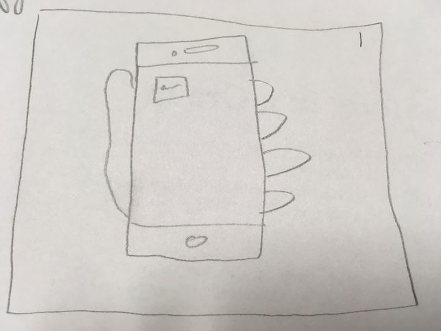
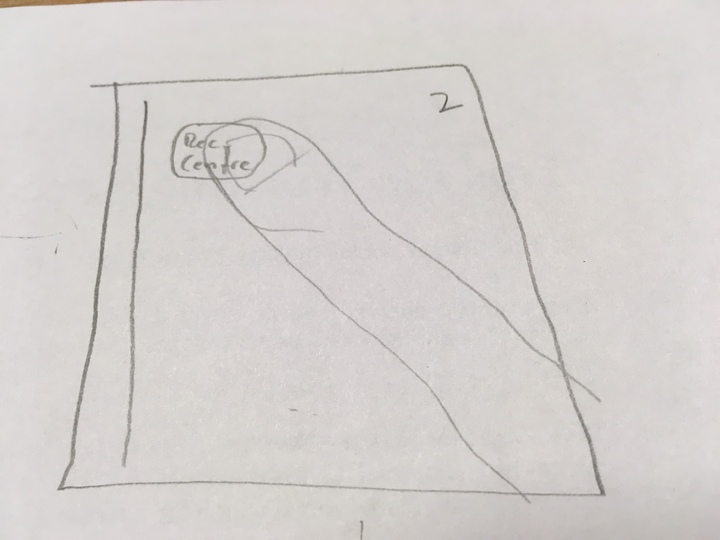
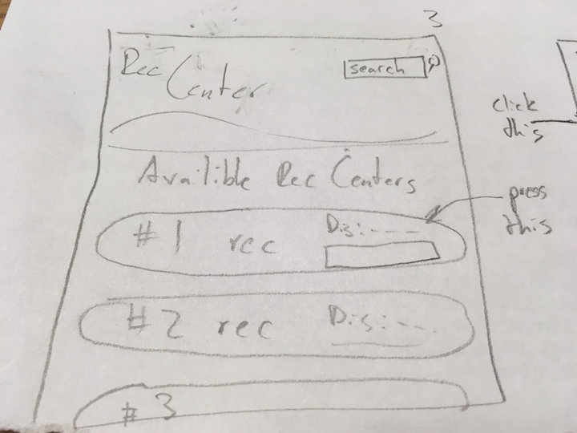
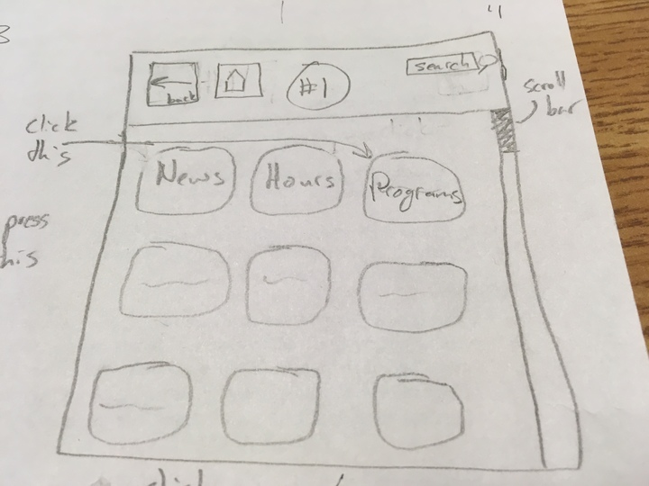

1. In the first frame we are showing the user holding their touch screen phone.
2. In the second frame we are opening the recreation center application on our mobile device.
3. In the third frame the user is tapping on the closest recreation center to their current location.
4. In the fourth frame we have the user navigating into the tab labeled "programs" for that currect recreation center that they are viewing.

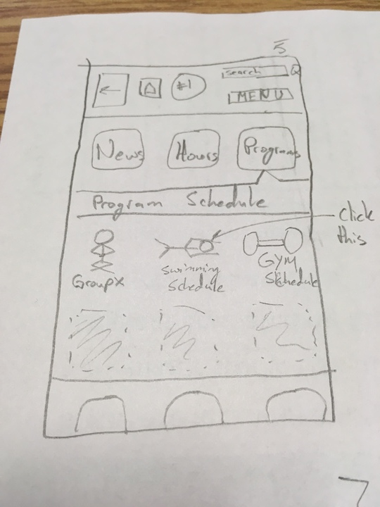
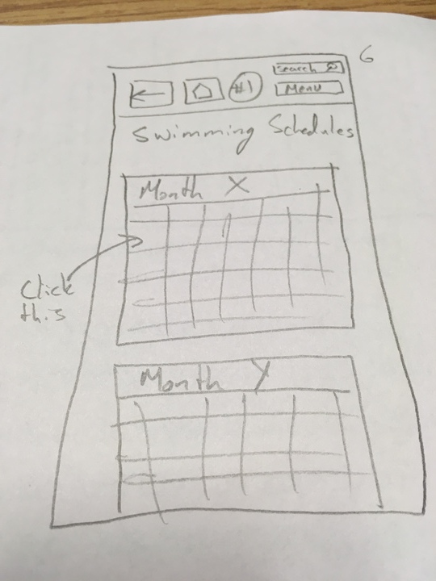
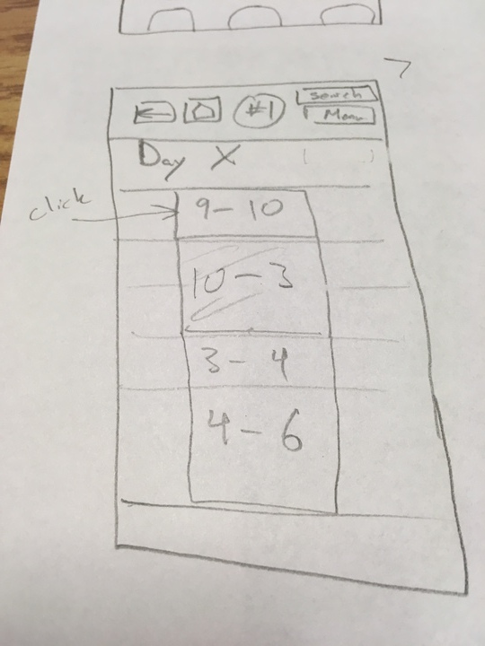
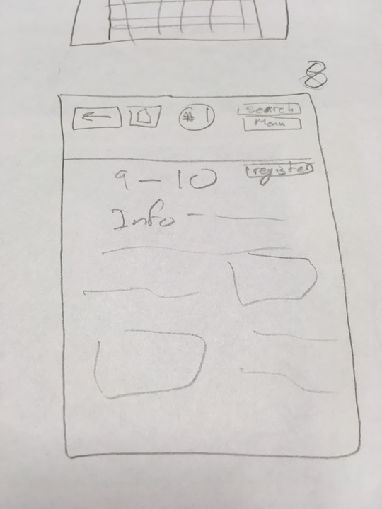

5. In the fifth frame we show the drop down menu that appears as a result of clicking on the "programs" tab, and then the user is clicking on the "swimming schedule" tab.
6. In the sixth frame the user is checking the swimming schedule for a particlar day, so thay tap on that specific day shown on the calendar.
7. In the seventh frame the user is tapping on one of the time blocks set for that day.
8. In the eigth frame the user is able to view any information listed for that time frame selected in the previous frame.

1. Shows the recreation center app on the iphone
2. Person pressing the app
3. Main menu that lists all the recreation center in calgary. Also includes a search bar so you can filter or look up centers. Our person is clicking on the southland recreation center.
4. Main page for southland with pictures of all the things Southland offers. On the top we have a house button that brings us to the list of all the recreation centers. We have a back button for going to the previous action the user performed and a search bar to search certain things southland has to offer.
5. Our user clicked on the programs icon so user can now see a more in depth view of what programs southland has to offer.
6. After clicking on one of the programs the user is given a calendar.
7. By clicking on one of the days you can now look at the schedule for that program on certain days.
8. By clicking on one of the times you are given some general information about that activity and a register button to register for the program/event.

## Task-Centered System Walkthrough

My name is Cindy and I’m a mother of 3. My 2 daughters Flow and Mindy ages 5 and 10 are looking to find information on dance classes. I’m looking to find the best possible situation so I don’t have to make multiple trips to the recreation center as juggling this many children and this many activities is rather difficult. I hope to be able to easily find classes with similar times for the proper age group. My son is aged 7 and is not interested in any classes but loves to swim. An ideal situation would allow me to find a multi use pass to take him swimming while the girls are in dance classes. 

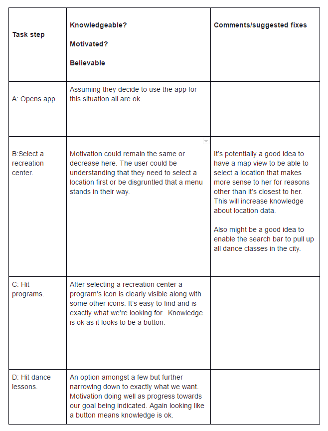
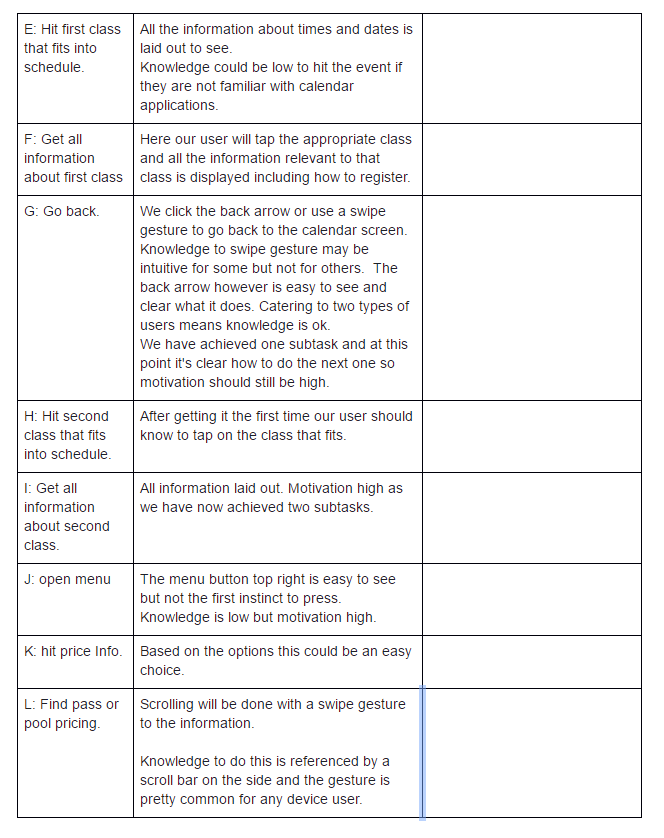

## Brainstorm and Affinity Diagram

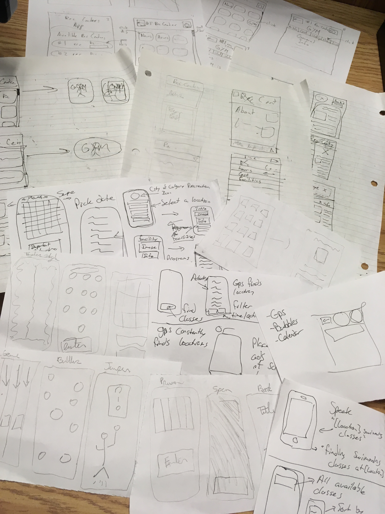

We have each created a variety of sketches of ideas for our recreation center application. These ideas range anywhere from games that determine an event you can do that day to a more in depth view of our user interface. We have learned a lot about the possibilities that exist, as well as some more creative options.

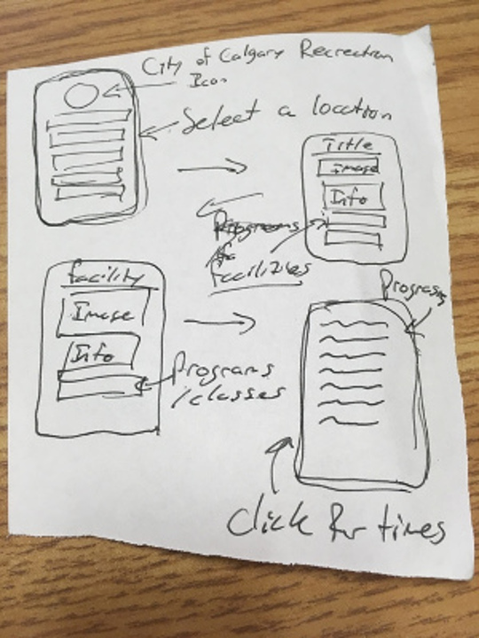
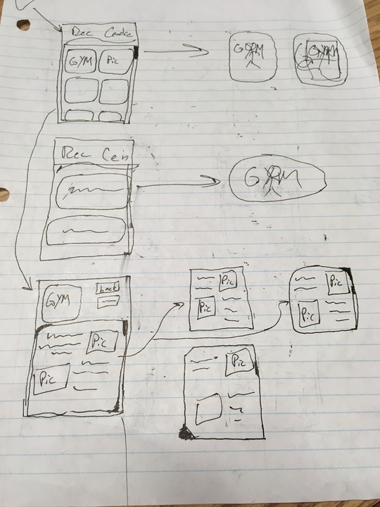

* This first image we have a more basic overview of our application and how the navigation should work. Illustrates some of the key options in a small storyboard format that will allow us to generate an idea of the options needed to include in our application prototype.  

* This second image also has somewhat of an overview, but instead of the navigation, it is more aimed towards how we want to layout or information page to page in a way that is visually appealing to our users, but also efficient and useful for navigating to the desired information.

## Reflection

When we first were trying to figure out our designs we were all over the place. Essentially what it boiled down to when we were looking at the brainstorm phase was that each of us had a different idea for what features our app should contain. So we mixed a hybrid of multiple ideas, pretty much taking the best part of each one of those ideas and discarding the rest. We then made the storyboard and prototype video based on our design and presented it in front of the class. When we presented our prototype we got a lot of questions asked and comments how others could improve our idea. It was then that we realised that our prototype was a mess with multiple features that didn’t really mix well together. So we scraped pretty much the whole thing and worked off of the based suggestions we got in tut. A few of the suggestions that we followed were to make a search bar, clear up the clutter when searching for rec centers, rearrange our buttons to better display what each of them meant, got rid of our search list (which was a bar at the bottom that popped up where you could see a list of all our information), rearranged how we organized and showed our information(since we got rid of the search list we needed to organize our information differently). Looking back at the whole process we did to get to our final design we probably should have looked at examples others had done before us and asked people who were not from our group to evaluate our ideas since we were slightly biased into thinking all our ideas were good.
