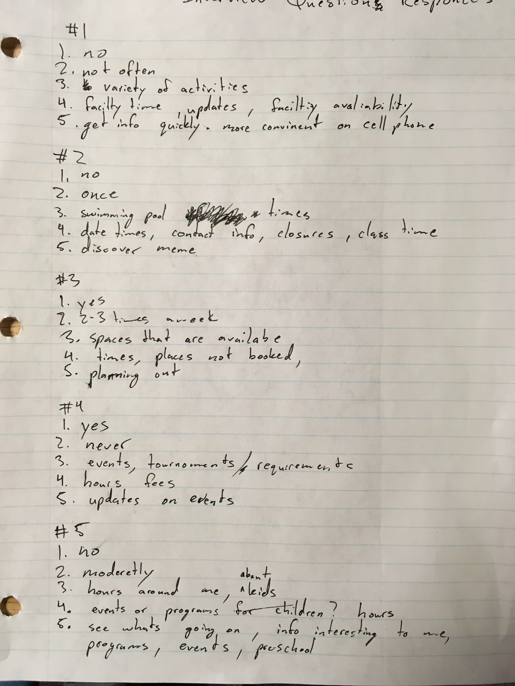
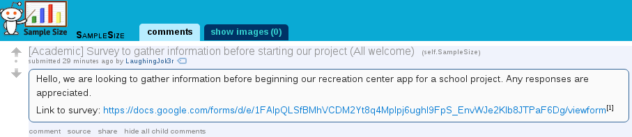
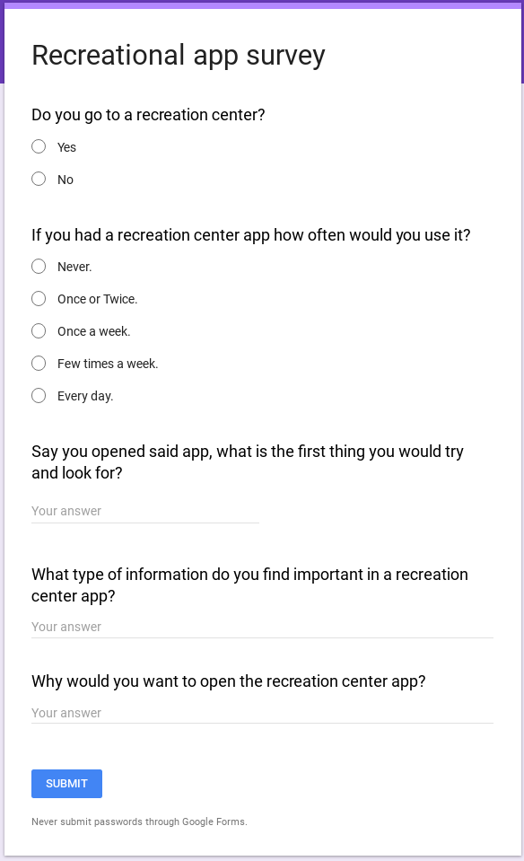
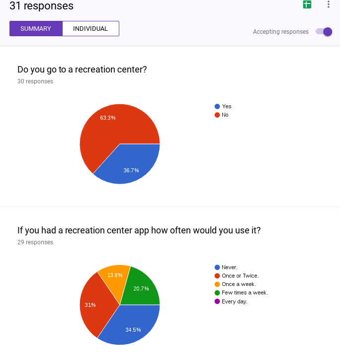
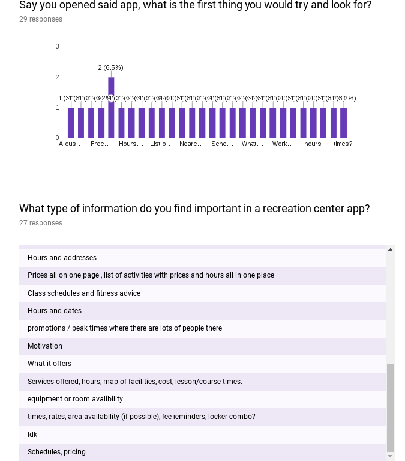
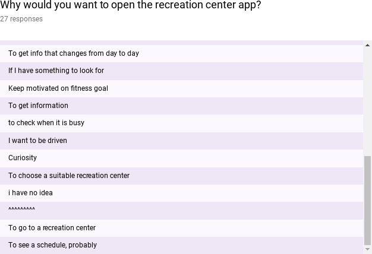
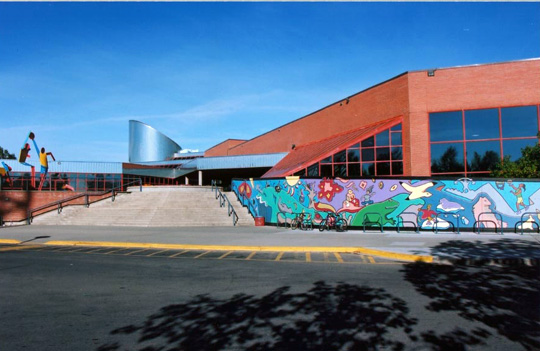

# P1: User Research

## Project Idea

The nature of our project is a recreational information application, which excels in providing information about recreation centers across Calgary. Our system is intended to be used as a phone application in which users are able to determine closest location of facilities within Calgary, as well as learn any information that they may need in terms of cost, facilities, or any classes / programs that they offer. We expect a wide variety of users ranging from everyday people looking for something fun to do that day all the way to parents looking for classes and day camps for their children. We want public events hosted and news posted by the recreational center to be easily accessible and advertised within the application. This could cause immediate changes to people's plans and the information they desire but could encourage more people to come out to such events. However we do not want to interfere with people looking to get straight to the information they need and this will be our primary focus. We will direct our application towards audiences of all ages and ethnicities as we feature a collection of locations across the city in which people can find what works best for them. We will also consider people needing information in a hurry and potentially with limited experience with technology. We expect people will use the application when making plans in the current moment and those planning to visit the recreational centers in the future. 

## Stakeholders and Users

####Potential stakeholders:

* CEO, board of directors, and shareholders would be stakeholders since the app could affect their recreational center in either a good or a bad way. So they do have something to lose when a customer complains on the app making other potential customers view the comment and decide not to go to their recreational center.

* All employees  of the recreation centers in Calgary will potentially be faced with questions about the application or the information it contains. They can even be asked how to get certain information through the application which would make them stakeholders.

* Calgary Recreation as they will be the primary supporters of the app development and the information offered.

* Citizens of calgary as taxpayers. This group of people would hypothetically(in the real world) be the people paying for this project. Is it worth doing with their money?

####Potential users:

* Heavy recreation center users: Users that came before we made the app. We expect many may not use our application at all as they already have a system of gathering information that works for them. 

* Newer or not consistent users: These users are looking to find general information and get involved in the community.

* School programs, teams or clubs: Users looking for general program information to do a mass registration. Not looking to enroll directly into existing classes but rather set up classes and facility times. 

* Employees: There could be employees that work as an information guide that could use this app to showcase or explain to customers information.

* Parents and teachers: This set of people would be looking for classes or information for their child to be involved in. They could also be looking at information that is more focused at themselves. 

## User Research Methods

The research methods that we used were interview, online survey, and secondary research. 

We used the interview method to speak face to face and determine if the questions we came up with were accurate and the participant was not confused by the phrasing of our question. We conducted the research in the MS lab and asked people if they wanted to partake in our research. The questions were overall well worded and allowed us insight to what people wanted. However due to the large range of the responses we got from the 5 participants we were unable to specifically narrow down what our potential users wanted.

### Interviews

#### SUMMARY OF FINDINGS
We used the interview method to speak face to face and determine if the questions we came up with were accurate and the participant was not confused by the phrasing of our question. We conducted the research in the MS lab and asked people if they wanted to partake in our research. The questions were overall well worded and allowed us insight to what people wanted. However due to the large range of the responses we got from the 5 participants we were unable to specifically narrow down what our potential users wanted.

### Surveys

#### SUMMARY OF FINDINGS
Next we used an online survey. We created the survey since our previous method was too slow and tedious, but we also needed a larger sample size to narrow down and see what our potential users wanted. Our questions to the survey were formulated by our previous research questions. The survey was created using google surveys and we posted it on reddit and left it overnight to gather responses (reddit link: https://www.reddit.com/r/SampleSize/comments/6dctne/academic_survey_to_gather_information_before/) . Our plan was successful since we were able to get 31 responses. By looking at the data we gathered from the survey we saw that most people wanted general information about facility, time and hours of the rec center, and real time status to see if the gym was crowded or if the swimming pool was booked or if the parking was full. 

### Secondary Research

#### University of Calgary Active Living:

* “Lots of interesting programs and classes to take. Instructors are always friendly. Great rental prices for gear if your looking to get out on your own.” -Trevor Low
	Translation: Interested in programs, classes, prices and gear U of C active living   can provide

* “Gym was extremely busy with every piece of equipment being used. Also smelled rather bad.”  -Chris Butler
	Translation: Would like to be able to view how busy the gym is before going

* “The ucalgary gym has tons of equipment and weights. The only downside is that it's almost always busy.” -Thomas Smith
	Translation: Would like to be able to view how busy the gym is before going

* “It's either very crowded or empty” -Ali Hamidoú
	Translation: Would like to be able to view how busy the gym is before going

#### Repsol Center:

* “It is one of the best gym's I have been. Pros: lots of equipment, great option for classes (boxing, zumba, boot camp, spin). Cons: classes get full really quick, can get busy during peak times. Staff is friendly, and so are people who come here.” -Tanmay Patil
	Translation: Would like to be able to view peak times of the gym and more info on classes and maybe an implementation of a class scheduler

* “It's one of the best recreational spaces in the city. It is pretty popular so it can get really crowded during peak hours but the pool areas are quite good along with the steam room (though the latter can get overcrowded). It's nice to see that a lot of athletic teams use the facility to practice, as I see it as a mark that it provides the best. On top of my wishlist would be a refurbishment or update of the locker and shower rooms.” - Precious de Leon
	Translation: Would like updates on how long the infrastructure will take.

* “Repsol is probably the best gym in Calgary because it has a variety of activities, equipments and classes offered to the members. The only downside is the parking and it could get pretty hectic at times when there are special event running.” - Brian Woo
	Translation: would like to be able to view events going on as well as have some way to see if the parking is full or not.

#### Village Square Leisure

* “We live in the far NW and trekked over to Village Square today to check it out (it's been over 20 years since I've been). Overall we had a great time - the wave pool was fun and I really liked that the splash park area had slides for all different ages/levels. The only critique I have is that on the way into the change room I noticed on the sign that children over 4 are expected to use the change room for their gender. This wasn't an issue today as both me and my husband were there, but I'm assuming there must be family change rooms somewhere? I wouldn't think that if my husband took the kids on his own that our 5 year old daughter would be expected to change on her own? Anyway, a small thing, easily solved I'm sure! Overall - loads of fun and the cost was unbeatable!”
	Translation: Simple not communicating the family change room that would have solved this problem

* “The slides and diving board were closed. The only good thing was that the weight room was basically empty. The parking lot was a mess of people that double parked....”
	Translation: Notices to what is closed would be nice. Being able to spontaneously find a  different activity is also good. 

* Terrible terrible!!! We came from a different province and were not told until we had paid that we only would have one hour to swim as it was Teen night(a little too late hey) We stayed positive at least we get to cool off and try something different. However we get inside and the Jungle Gym Area is closed, my kids got to go through the Water Park side once and then they closed it off. We were stuck to the wave pool. I was in a car accident recently and the waves were terrible so I had to basically sit out and watch . My daughter who uses snorkel goggles (she is 7 and does not like water up her nose)was told to either take them off or get out(WTF)... So we left. We were there a total of 35 min! I have called for over 2 weeks and left messages and no one bothers to return my calls....I will never return here and will make sure all our family and friends stay away from this facility! Not a nice way to treat people especially small children!!!
	Translation:  Add phone numbers to contact the facility Lots of comments about phoning the facility. Its information people are using. Post hours clearly especially when  other activities affect the hours somebody can use the facility. Make rules and postings about facilities clear so nobody is surprised when they attend. 

* Good arena minus the strange boards that are dead. Strange benches too but that's not a big deal. very clean, every time I am there. The drop in hockey Monday afternoons is usually quiet.
	Translation:   Maybe advertise activities that see low attendance.

#### SUMMARY OF FINDINGS
Our last research method was secondary research. We wanted to confirm that the responses we got from our survey were authentic and similar to problems people had in the real world. For this we looked up reviews on three separate recreation centers to see what people had praised or complained about. The reviews that we found matched up to the responses we got from our survey, meaning that our survey gathered similar information to the reviews we found online. 

### Reflections on User Research

Overall our methods to gather information went well. However what we could have done for our interview method was to change the location of where we were finding participants. For our interview we asked people in the MS cpsc lab to participate; although our fellow comrades were the easiest to ask questions they may not have been the best sample to question. What we should have done was to go ask people at a recreation center our questions as they could have held more insight since they were active users of said facility. (For example we could have gone to UofC’s Active Living Center and right outside the gym asked users going in and out if they would participate in our research gathering).

## Task Descriptions

* My name is Cindy and I’m a mother of 3. My 2 daughters Flow and Mindy ages 5 and 10 are looking to find information on dance classes. I’m looking to find the best possible situation so I don’t have to make multiple trips to the recreation center as juggling this many children and this many activities is rather difficult. I hope to be able to easily find classes with similar times for the proper age group. My son is aged 7 and is not interested in any classes but loves to swim. An ideal situation would allow me to find a multi use pass to take him swimming while the girls are in dance classes. 

* Hello I’m Mr.Crawford the active living coordinator at Father Whelihan Elementary and Junior High. I am in desperate need of finding information about the instructors and programs at Canyon Meadows pool. Ultimately I would like to contact the faculty and arrange to bring in busloads of grade 5 students twice a week for 3 weeks for them to get swimming lessons. Before I phone the faculty I would like to know which times will likely work by looking at a schedule of the pool and seeing what times are not super busy and have a general idea which grade level of swimming instruction would be best for the students. 

* My name is Harriot Chi and I just moved to canada with my family. Sadly my english is not very good yet and finding my way around the city is very difficult. I was looking to find a recreation center close to our home and what hours they have open for drop in use. It is imperative I know the prices and if there are special rates for families as funds are short and our family is large. 

* This is Britney, she attended the southland leisure center last week with her two kids. The faculty was downright gross and one of the instructors was very mean to her child and should be terminated immediately. At the very least she needs to change her child’s enrollment to a different class, and would also like to send in a formal complaint about the instructor and the maintenance of the faculty. Where is the phone number for the manager? 

* Hello Im Tyler and Im 17 years old. It's the middle of the afternoon on a friday, my friends and I are looking for something to do. Perhaps there's open swimming or a teen night at the recreation center. I only have 11$ in my bank account.  Can I consume alcohol by the pool or in the hottub? 

* Hello Im Sammy Joe the most wild western joe around. I was looking to attend every stampede breakfast in the city and heard recreation centers have the best breakfasts in these here parts. When and where do I find these mystical breakfasts?

* Alfred Han has recently immigrated from the Philippines with his daughter Mary, and son Lucas. Back in the Philippines they would go swimming all the time. Alfred would like to take his children to the pool at least once a week and would like to know when it is moderately busy so his children can meet some new friends. He is also concerned about whether there is a family room or not at the recreation center.

<!-- 
## Resources
More insight into how to conduct certain methods
http://www.interaction-design.org/encyclopedia/
Sharp, H., Rogers, Y., and Preece, J. Interaction Design. (2002).
Moggridge, B. (2007) Designing Interactions. Cambridge, MA: The M.I.T. Press
http://designresearchtechniques.com/ - Even more research methods!
Task-centered Design Reading
Working through Task-Centered System Design. Greenberg, S. (2003) in Diaper, D. and Stanton, N. (Eds) The Handbook of Task Analysis for Human-Computer Interaction. Lawrence Erlbaum Associates.
-->
