# P3: Hi-fi Prototypes and Heuristic Evaluation

## Link to Demo System

[Working Demo](https://triickshotz.github.io/RecreationCenterApplication/index.html)

## Highlight Walkthrough

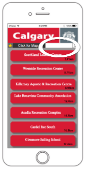
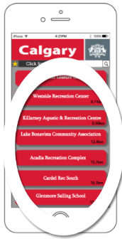
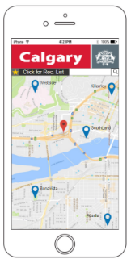
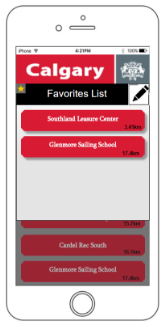

Navigating to the desired recreational center. In our app we strived to make sure that we gave our users the ability to freely navigate when searching up a recreational center. The tools we gave them as listed above.

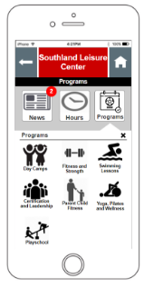
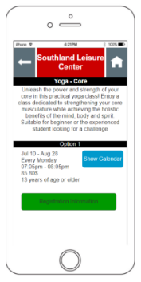
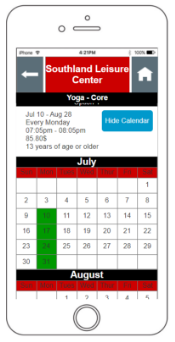
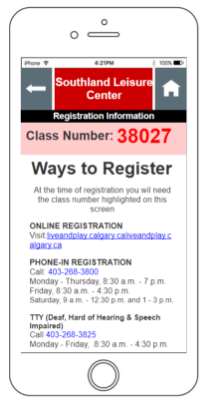

Highlight walkthrough for how a user can enroll in a class for a specific program, as well as learn how to browse for different classes.

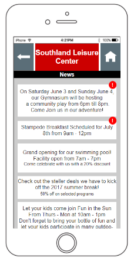
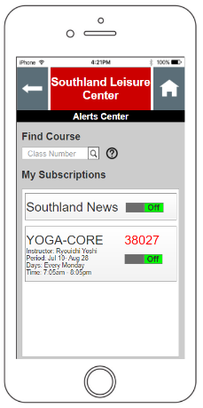

How to get the alerts for a class, as well as enable and disable the alerts.

## Heuristic Evaluation Results

### Help and Documentation

#### Problem: Yoga-Core calendar has no legend, what do the green squares mean?

#### Solution: Add a legend or some other indicator to let the user know that the green squares mean that there is an available class that day.

## Raw Heuristic Evaluation Notes

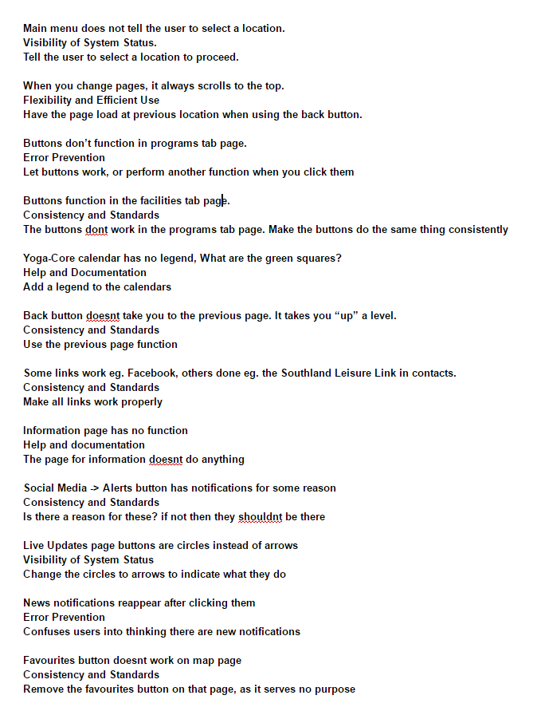
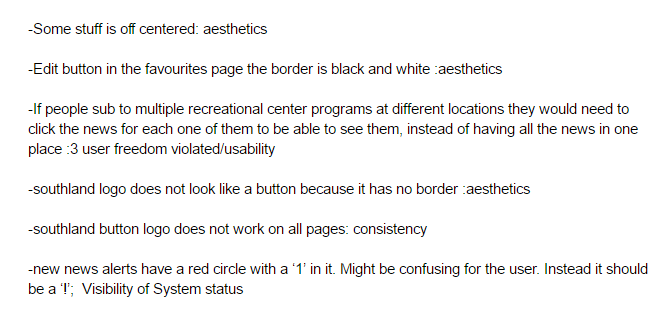
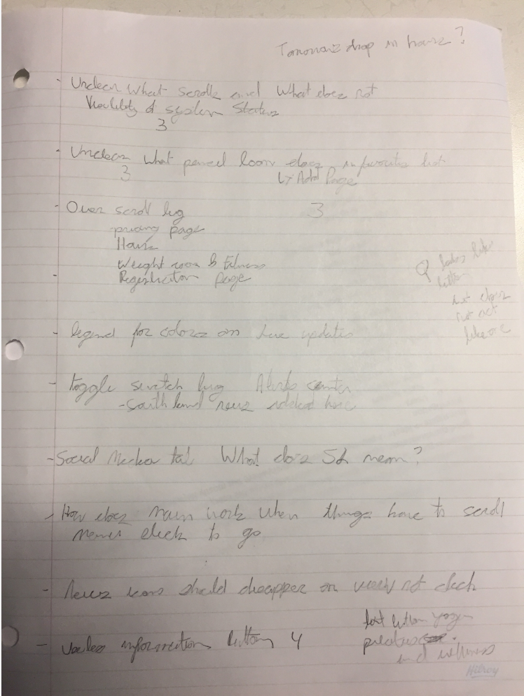

